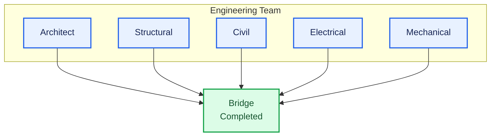
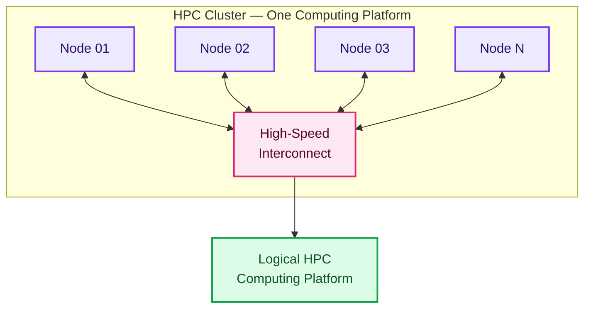
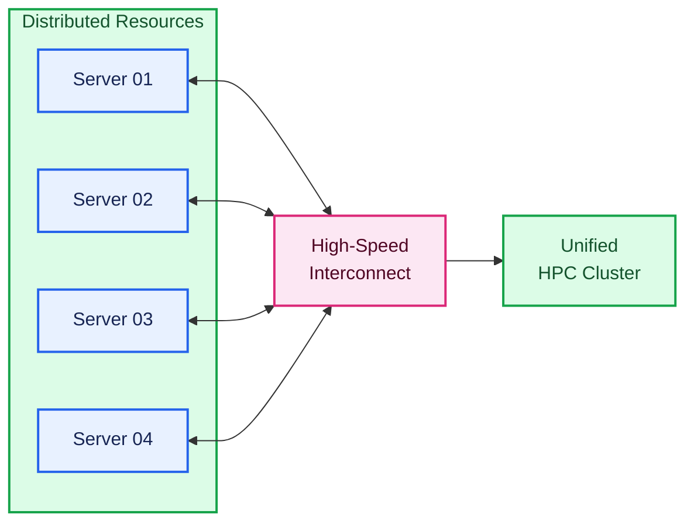
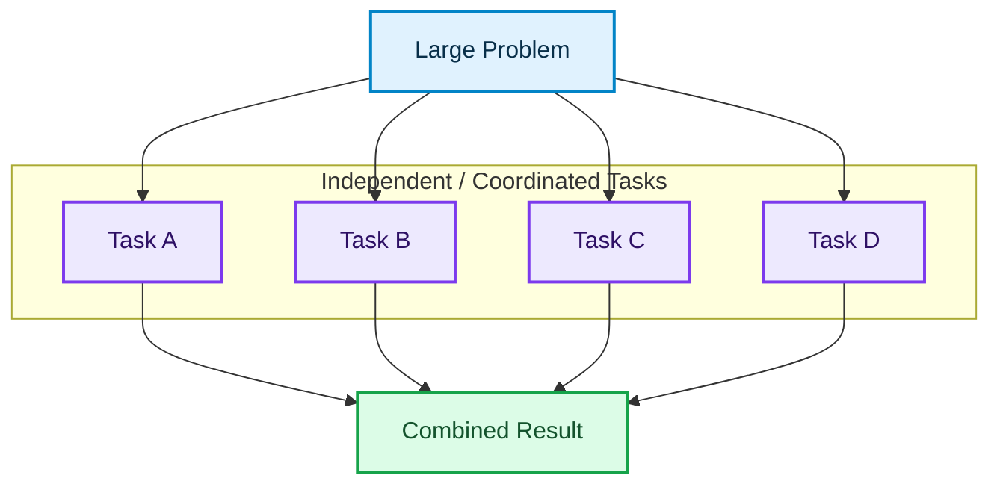
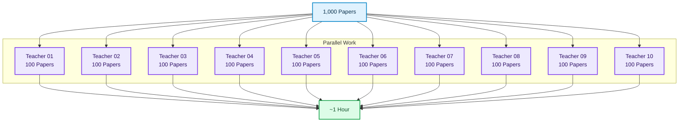
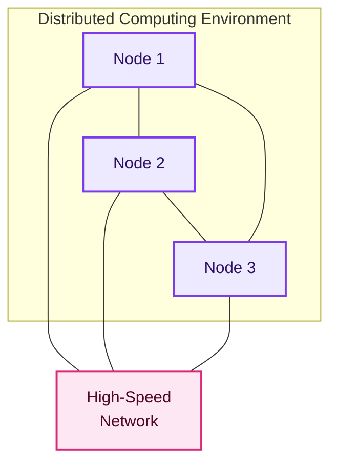
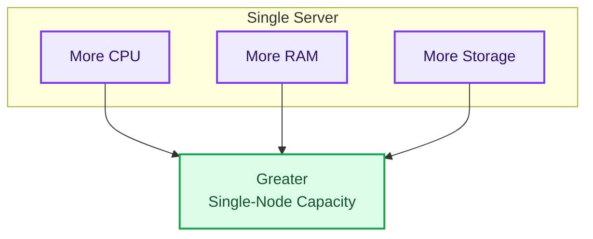
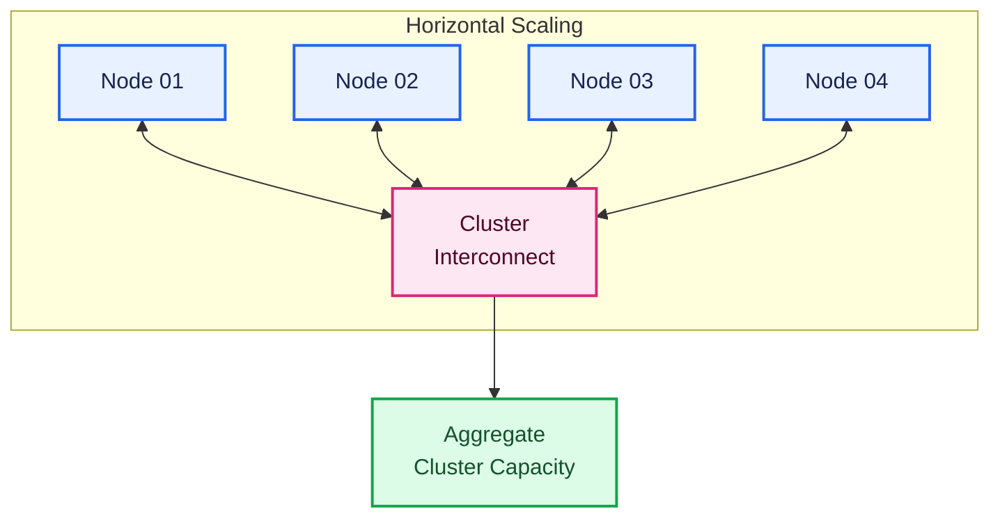

## Part 1 – Foundations of High Performance Computing

* [1.1 What is High Performance Computing?](#11-what-is-high-performance-computing)
* [1.2 Why Does HPC Exist?](#12-why-does-hpc-exist)
* [1.3 Evolution of Computing](#13-evolution-of-computing)
* [1.4 Parallel Computing](#14-parallel-computing)
* [1.5 Distributed Computing](#15-distributed-computing)
* [1.6 Vertical vs Horizontal Scaling](#16-vertical-vs-horizontal-scaling)
* [1.7 Characteristics of an HPC System](#17-characteristics-of-an-hpc-system)
* [1.8 Real-World Applications of HPC](#18-real-world-applications-of-hpc)

# 1.1 What is High Performance Computing?

## Definition

High Performance Computing (HPC) is the practice of combining many computing resources so they operate as a single logical system capable of solving computational problems that exceed the capabilities of a single computer.

Rather than making one computer extremely powerful, HPC connects many computers through a high-speed network and coordinates their work to solve large problems efficiently.

In simple terms:

> **HPC is about solving bigger problems faster by allowing many computers to work together.**

---

## Engineering Perspective

Think of a construction project.

### Traditional Computing

One engineer attempts to build an entire bridge alone.

The work is sequential and slow.

---

### HPC

A complete engineering team works simultaneously.

Every team works in parallel, dramatically reducing the overall completion time.

An HPC cluster follows the same philosophy.

---

## The Mental Model

An HPC cluster should not be viewed as hundreds of independent servers.

Instead, think of it as **one giant computer** built from many smaller computers.

Users typically interact with the cluster as though it were a single system, while the scheduler and infrastructure distribute work across many compute nodes.

---

# 1.2 Why Does HPC Exist?

## The Problem

As scientific and engineering challenges grew more complex, a single server was no longer sufficient.

Consider the following examples:

* Simulating global weather patterns
* Training a large language model (LLM)
* Genome sequencing
* Drug discovery
* Computational Fluid Dynamics (CFD)
* Earthquake simulation
* Financial risk analysis

These workloads require:

* Trillions of calculations
* Terabytes of memory
* Massive datasets
* Fast communication between processors

A single machine eventually reaches physical and economic limits.

---

## The Solution

Instead of building one infinitely large server, engineers connect many servers into a cluster.

Each server contributes CPU cores, memory, storage, and network bandwidth to the overall platform.

This approach provides:

* Higher performance
* Better scalability
* Fault isolation
* More efficient resource utilization

---

# 1.3 Evolution of Computing

Computing has evolved in response to increasing computational demands.

Each stage represents a shift toward greater parallelism and larger-scale resource sharing.

---

## Why the Shift Happened

As processors became faster, simply increasing clock speeds was no longer practical due to power consumption and heat dissipation.

The industry responded by:

* Adding more CPU cores.
* Deploying multiple servers.
* Introducing high-speed interconnects.
* Leveraging GPUs for massively parallel workloads.

Modern AI infrastructure is the latest stage of this evolution.

---

# 1.4 Parallel Computing

## Definition

Parallel computing divides a large problem into multiple smaller tasks that execute simultaneously.

Instead of processing one task after another:

the tasks execute concurrently:

This significantly reduces execution time when the problem can be decomposed into independent or coordinated subtasks.

---

## Everyday Example

Imagine grading 1,000 exam papers.

### Sequential

### Parallel

The total work is unchanged, but the completion time is dramatically reduced.

---

# 1.5 Distributed Computing

Parallel computing answers the question:

> **How can multiple tasks run at the same time?**

Distributed computing answers:

> **Where do those tasks run?**

In a distributed system, tasks execute across multiple physical computers connected by a network.

Each node performs part of the overall computation while coordinating with the others.

---

## Parallel vs Distributed

| Parallel Computing                        | Distributed Computing                           |
| ----------------------------------------- | ----------------------------------------------- |
| Focuses on executing tasks simultaneously | Focuses on using multiple physical machines     |
| May occur on one machine or many          | Always spans multiple machines                  |
| Reduces execution time                    | Increases scalability and resource availability |

Modern HPC combines **both** approaches.

---

# 1.6 Vertical vs Horizontal Scaling

## Vertical Scaling

Increase the capacity of a single server.

Advantages:

* Simpler administration.
* No application redesign required.

Limitations:

* Hardware limits.
* High cost.
* Single point of failure.

---

## Horizontal Scaling

Add additional servers.

Advantages:

* Better scalability.
* Incremental growth.
* Improved resilience.
* Higher aggregate performance.

This is the architectural principle behind HPC clusters.

---

# 1.7 Characteristics of an HPC System

A modern HPC system typically exhibits the following characteristics:

| Characteristic         | Description                                     |
| ---------------------- | ----------------------------------------------- |
| Parallel Processing    | Many tasks execute simultaneously.              |
| Distributed Resources  | Compute is spread across multiple nodes.        |
| Low-Latency Network    | Fast communication between nodes.               |
| Shared Storage         | Data is accessible to all compute nodes.        |
| Centralized Scheduling | Jobs are managed by a workload manager.         |
| Scalability            | New nodes can be added with minimal disruption. |
| High Availability      | Critical services minimize downtime.            |
| Automation             | Provisioning and management are automated.      |

---

# 1.8 Real-World Applications of HPC

HPC supports a wide range of industries.

| Industry                | Example Workloads                                                |
| ----------------------- | ---------------------------------------------------------------- |
| Scientific Research     | Climate modeling, astrophysics, molecular dynamics               |
| Engineering             | CFD, finite element analysis, crash simulation                   |
| Healthcare              | Genomics, protein folding, drug discovery                        |
| Finance                 | Monte Carlo simulations, fraud detection, portfolio optimization |
| Energy                  | Reservoir simulation, seismic imaging                            |
| Manufacturing           | Digital twins, product design optimization                       |
| Artificial Intelligence | Deep learning, LLM training, recommendation systems              |

The rapid growth of AI has significantly increased the demand for GPU-accelerated HPC infrastructure.

---

# Production Insight

> HPC is not simply "many servers connected together." It is an integrated ecosystem in which compute, networking, storage, scheduling, authentication, and monitoring work together. A failure in any one layer can impact the entire workload. Successful infrastructure engineers understand these dependencies rather than viewing each technology in isolation.

---

# Best Practices

* Focus on understanding concepts before memorizing commands.
* Think in terms of systems rather than individual machines.
* Always consider scalability when designing infrastructure.
* Remember that network latency is often as important as raw CPU performance.
* Develop a habit of documenting architectural decisions and operational procedures.

---

# Interview Questions

1. What is High Performance Computing, and how would you explain it to a non-technical audience?
2. Why can't organizations simply purchase larger servers instead of building HPC clusters?
3. Explain the difference between parallel computing and distributed computing.
4. What are the primary characteristics of an HPC system?
5. Why is horizontal scaling preferred in HPC environments?
6. Name five real-world industries that rely heavily on HPC.

---

# Summary

In this part, we established the foundation for understanding High Performance Computing. We explored why HPC exists, how it evolved from traditional computing, and the core principles of parallelism, distributed systems, and horizontal scaling. These concepts form the basis for modern AI infrastructure and will be referenced throughout the remainder of this handbook.

---

## Next Part

**Part 2 – Evolution to AI Infrastructure**

Topics:

* HPC vs Cloud Computing
* HPC vs AI Infrastructure
* AI Factory Concept
* Evolution from CPU Clusters to GPU Clusters
* Modern AI Workloads
* Why NVIDIA Changed HPC Forever
* The Rise of Foundation Models
