# Part 2 – HPC Software Stack and Cluster Architecture

- [2.1 HPC Software Stack](#21-hpc-software-stack)
- [2.2 HPC Job Lifecycle](#22-hpc-job-lifecycle)
- [2.3 Data Flow Inside an HPC Cluster](#23-data-flow-inside-an-hpc-cluster)
- [2.4 Compute Layer (CPU & GPU)](#24-compute-layer-cpu--gpu)
- [2.5 Memory Layer](#25-memory-layer)
- [2.6 Storage Layer](#26-storage-layer)
- [2.7 Network Fabric](#27-network-fabric)
- [2.8 Putting Everything Together](#28-putting-everything-together)
- [Production Insight](#production-insight)
- [Key Takeaways](#key-takeaways)

---

# 2.1 HPC Software Stack

## Concept

An HPC cluster is much more than a collection of servers. It is a layered software ecosystem where each layer provides a specific capability required to execute scientific or AI workloads.

Each layer depends on the layer beneath it.

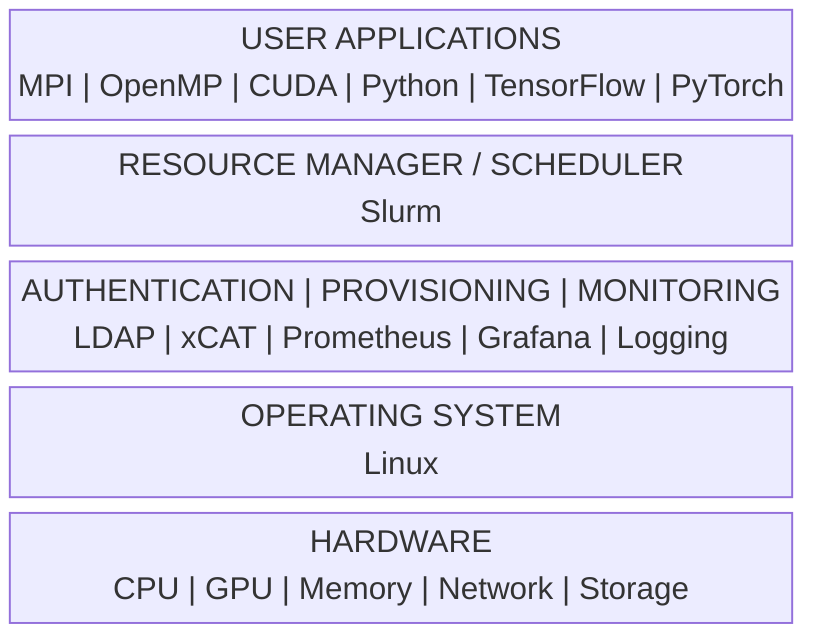

---

## Software Stack Layers

| Layer | Purpose |
|--------|---------|
| Applications | Scientific simulations, AI training, analytics |
| Runtime Libraries | MPI, CUDA, NCCL, OpenMP |
| Scheduler | Allocates compute resources |
| Provisioning | Deploys operating systems and manages nodes |
| Authentication | User identity management |
| Monitoring | Observability and alerting |
| Operating System | Hardware abstraction and resource management |
| Hardware | Physical compute infrastructure |

---

## Why Layered Architecture?

A layered architecture provides:

- Scalability
- Maintainability
- Modularity
- Easier troubleshooting
- Technology independence

For example:

Changing the scheduler does not require replacing the storage system.

Replacing GPUs does not require redesigning authentication.

---

# 2.2 HPC Job Lifecycle

## Concept

Users do not directly execute workloads on compute nodes.

Instead, every workload follows a controlled execution path managed by the scheduler.

This ensures:

- Fair resource allocation
- Security
- Efficient utilization
- Job accounting

---


## Job Lifecycle Overview

Rather than treating the lifecycle as a single straight pipeline, it is useful to view it as a **control loop**.

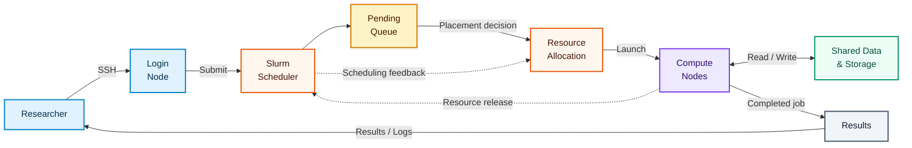

The important point is that **the scheduler remains involved even after a job has been submitted**. It controls placement, tracks resources, and eventually receives those resources back when the job finishes.

---

## Step 1 — User Login

Users connect to the login node using SSH.

```
ssh researcher@login01
```

The login node is used for:

- Editing code
- Compiling applications
- Preparing datasets
- Submitting jobs

Heavy computations should **never** run on login nodes.

---

## Step 2 — Job Submission

Users describe resource requirements.

Example:

- CPUs
- Memory
- GPUs
- Runtime
- Partition

The scheduler records the request.

---

## Step 3 — Queue

Jobs enter a waiting queue.

The scheduler determines:

- Priority
- Available resources
- Policies
- Reservations

Not every submitted job starts immediately.

---

## Step 4 — Scheduling

The scheduler evaluates:

- Available nodes
- CPU availability
- GPU availability
- Memory
- Time limits
- Queue priority

The best placement is selected.

---

## Step 5 — Execution

Allocated compute nodes execute the application.


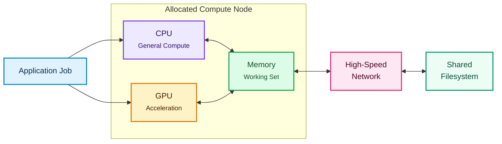

The user normally never logs into compute nodes manually.

---

## Step 6 — Data Processing

Applications frequently interact with shared storage during execution.

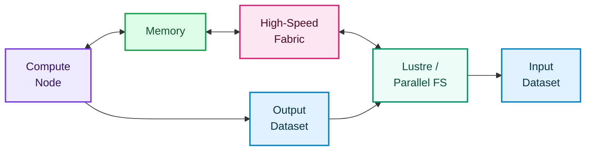

Large AI workloads may read terabytes of data during execution, making storage and network performance just as important as raw compute capability.

---

## Step 7 — Completion

When the job finishes:

1. The scheduler records the job state.
2. Resources are released.
3. Accounting information is stored.
4. The resources become available to other workloads.

The cluster therefore behaves as a shared resource pool rather than a collection of permanently assigned servers.

---

# 2.3 Data Flow Inside an HPC Cluster

Understanding data movement is essential.

Applications spend significant time moving data rather than performing calculations.

---

## Overall Data Flow

A useful way to visualize an HPC workload is to separate **control traffic**, **compute activity**, and **data movement**.

```mermaid
flowchart LR

    USER["User"]

    subgraph CONTROL["Control Plane"]
        LOGIN["Login Node"]
        SLURM["Slurm"]
    end

    subgraph COMPUTE["Compute Plane"]
        CPU["CPU"]
        GPU["GPU"]
        MEM["Memory"]
    end

    subgraph DATA["Data Plane"]
        FABRIC["High-Speed Fabric"]
        STORAGE["Parallel Storage"]
    end

    RESULTS["Results"]

    USER -->|SSH / Submit| LOGIN
    LOGIN -->|Job Request| SLURM
    SLURM -->|Allocation| CPU

    CPU <--> GPU
    CPU <--> MEM
    GPU <--> MEM

    MEM <--> FABRIC
    FABRIC <--> STORAGE

    STORAGE -->|Output| RESULTS
    RESULTS --> USER

    classDef user fill:#E0F2FE,stroke:#0284C7,color:#082F49,stroke-width:2px
    classDef control fill:#FFF7ED,stroke:#EA580C,color:#431407,stroke-width:2px
    classDef compute fill:#EDE9FE,stroke:#7C3AED,color:#2E1065,stroke-width:2px
    classDef data fill:#ECFDF5,stroke:#059669,color:#064E3B,stroke-width:2px
    classDef result fill:#F1F5F9,stroke:#475569,color:#0F172A,stroke-width:2px

    class USER user
    class LOGIN,SLURM control
    class CPU,GPU,MEM compute
    class FABRIC,STORAGE data
    class RESULTS result
```

This separation is important because an HPC application may be perfectly healthy from a compute perspective while still being limited by storage or network performance.

---

## Detailed Workflow

Instead of representing the detailed workflow as one long chain, think of the workload as **three interacting paths**:

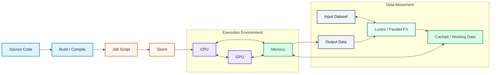

This representation highlights an important HPC concept:

> **Execution and data movement happen together.**

The application is not simply "running on a CPU or GPU." It continuously moves information between memory, accelerators, the network, and storage.

---

## Why Data Flow Matters

Poor data flow leads to:

* Slow jobs
* Network congestion
* Storage bottlenecks
* GPU starvation

Understanding the path helps identify performance issues.

For example, a GPU can be extremely powerful but still remain underutilized if it is waiting for data from memory or storage.

---

# 2.4 Compute Layer (CPU & GPU)

The compute layer performs calculations.

It consists of CPUs and increasingly GPUs.

---

## CPU

The CPU is responsible for:

* Operating system execution
* Scheduling
* MPI communication
* General-purpose computation
* File system operations

A CPU can be viewed as the flexible control and computation engine of the node.

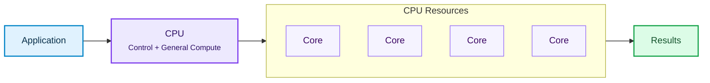

CPUs are optimized for flexibility, branching, operating-system activity, and general-purpose computation.

---

## GPU

GPUs accelerate massively parallel workloads.

Typical AI workloads include:

* Matrix multiplication
* Neural network training
* Scientific simulations
* Deep learning inference

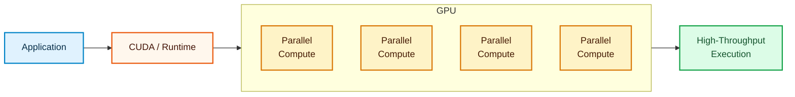

The important distinction is not simply "CPU versus GPU."

It is **general-purpose flexibility versus massively parallel throughput**.

---

## CPU vs GPU

| CPU                            | GPU                            |
| ------------------------------ | ------------------------------ |
| Few powerful cores             | Many parallel processing units |
| Low latency                    | High throughput                |
| Sequential and mixed workloads | Highly parallel workloads      |
| OS and system management       | Numerical acceleration         |

Modern HPC clusters frequently combine both.

---

## Heterogeneous Computing

Modern systems combine multiple processor types.

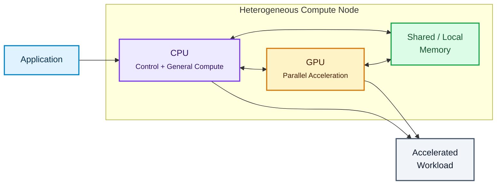

This architecture is known as **heterogeneous computing**.

---

# 2.5 Memory Layer

Memory acts as the workspace for applications.

Without sufficient memory, applications cannot execute efficiently.

---

## Memory Hierarchy

Instead of showing memory as a simple vertical ladder, the hierarchy is better understood as a **funnel of capacity versus speed**.


The hierarchy represents a fundamental HPC trade-off:

**Higher speed generally comes with lower capacity and higher cost per byte.**

---

## Memory Usage

Applications store:

* Variables
* Matrices
* Neural network parameters
* Temporary buffers
* Input datasets

Large AI models may require hundreds of gigabytes of memory.

For GPU workloads, memory capacity and memory bandwidth can become major factors in determining how much work an accelerator can sustain.

---

## Memory Bottlenecks

Common issues include:

* Insufficient RAM
* NUMA imbalance
* Excessive swapping
* Memory fragmentation

These significantly reduce application performance.

A memory-bound application may have powerful CPUs and GPUs available but still spend much of its execution time waiting for data.

---

# 2.6 Storage Layer

Storage holds user data and application outputs.

Unlike desktop systems, HPC clusters use shared storage accessible from many compute nodes.

---

## Storage Architecture

A parallel storage system is best represented as a **shared data plane** rather than a simple storage server sitting below the compute nodes.

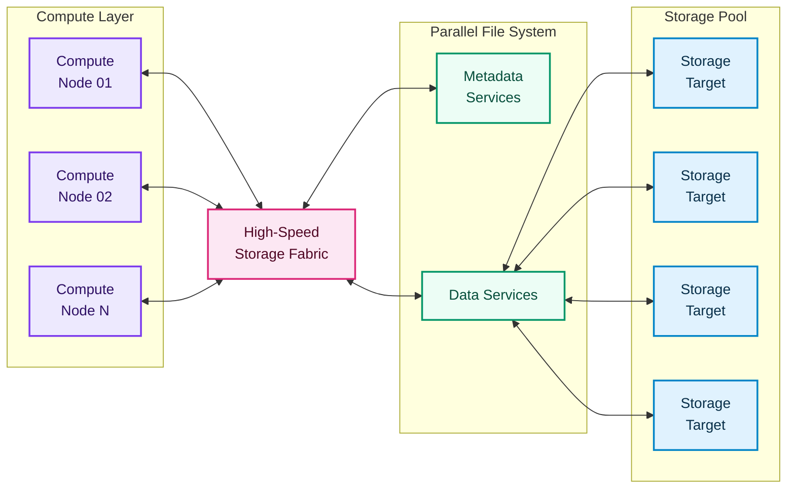

This structure allows many compute nodes to access data concurrently.

---

## Storage Types

| Type             | Purpose                 |
| ---------------- | ----------------------- |
| Local Disk       | Operating system        |
| NVMe SSD         | Temporary scratch space |
| Parallel Storage | Shared datasets         |
| Archive Storage  | Long-term retention     |

---

## Parallel File Systems

Examples include:

* Lustre
* IBM Spectrum Scale (GPFS)
* BeeGFS

Parallel file systems allow many compute nodes to read and write simultaneously.

A useful conceptual view is:

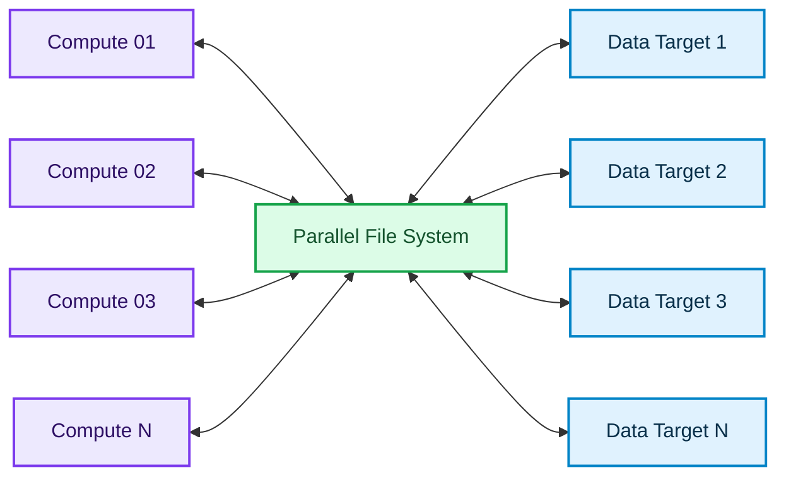

The key idea is **parallelism**: storage bandwidth can be distributed across multiple targets rather than depending on one disk or one server.

---

## Storage Requirements

A production storage system should provide:

* High throughput
* Redundancy
* Scalability
* Fault tolerance
* Shared access

---

# 2.7 Network Fabric

The network fabric connects every component of the cluster.

Without a high-speed network, an HPC cluster cannot function efficiently.

---

## Cluster Network

Instead of thinking of the network as a single cable between components, consider it as multiple interconnected traffic paths.

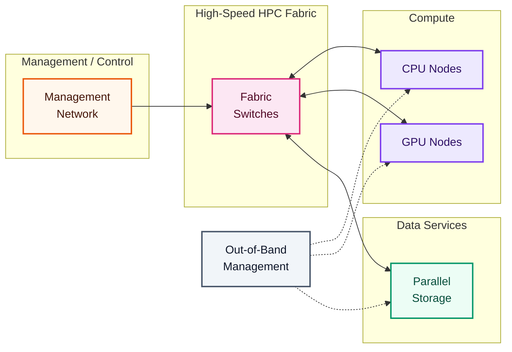

---

## Why Network Performance Matters

Applications frequently exchange:

* MPI messages
* Storage traffic
* GPU communication
* Job control messages

Network performance directly affects overall application speed.

For tightly coupled HPC applications, communication latency can be just as important as bandwidth.

---

## Ethernet vs InfiniBand

| Ethernet            | InfiniBand                  |
| ------------------- | --------------------------- |
| General networking  | HPC communication           |
| Higher latency      | Extremely low latency       |
| Broad ecosystem     | High-performance fabric     |
| Standard enterprise | Scientific and AI computing |

Dedicated chapters will explore InfiniBand in detail.

---

## Network Components

Typical HPC networks include:

* Management Network
* High-Speed Fabric
* Storage Network
* Out-of-band management

Separating traffic improves reliability and performance.

---

# 2.8 Putting Everything Together

The complete HPC environment is easier to understand when viewed as several interacting planes rather than one large workflow.

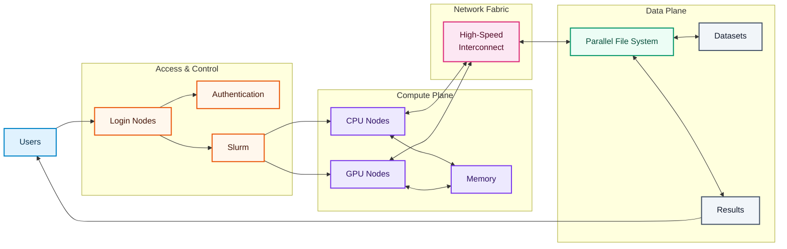

This architecture shows the major relationships:

* **Users** interact with the cluster through controlled access points.
* **Authentication** determines who is allowed to use the environment.
* **Slurm** determines when and where workloads run.
* **CPU and GPU nodes** perform computation.
* **Memory** provides the active workspace for those computations.
* **The network fabric** carries communication and data traffic.
* **Parallel storage** provides shared access to datasets and results.

Every component contributes to successful job execution.

Removing any layer compromises the functionality of the entire cluster.

---

# Production Insight

Production HPC environments rarely experience failures caused by a single component.

A user's job may remain pending because no GPUs are available, fail because the shared filesystem is unavailable, or terminate because of insufficient memory.

The important operational lesson is that these are rarely isolated problems.

A scheduler problem can appear as a compute problem.

A storage problem can appear as a GPU utilization problem.

A network problem can appear as a slow application.

Effective troubleshooting therefore requires understanding how **compute, storage, networking, scheduling, and authentication interact as one integrated platform**.

---

# Key Takeaways

* HPC clusters are built using a layered software architecture.
* Workloads follow a controlled job lifecycle managed by a scheduler.
* Data movement is as important as computation.
* Modern clusters combine CPUs and GPUs for heterogeneous computing.
* Memory hierarchy directly impacts application performance.
* Parallel storage enables shared, high-throughput access to data.
* High-speed network fabrics minimize communication latency.
* Every layer of the HPC stack depends on the layers beneath it.
* Production troubleshooting requires looking across the entire platform rather than focusing on a single component.

---

## Next Part

**Part 3 – Core HPC Technologies**

Topics covered:

* Linux
* xCAT
* Slurm
* LDAP
* Lustre
* InfiniBand
* NVIDIA GPU
