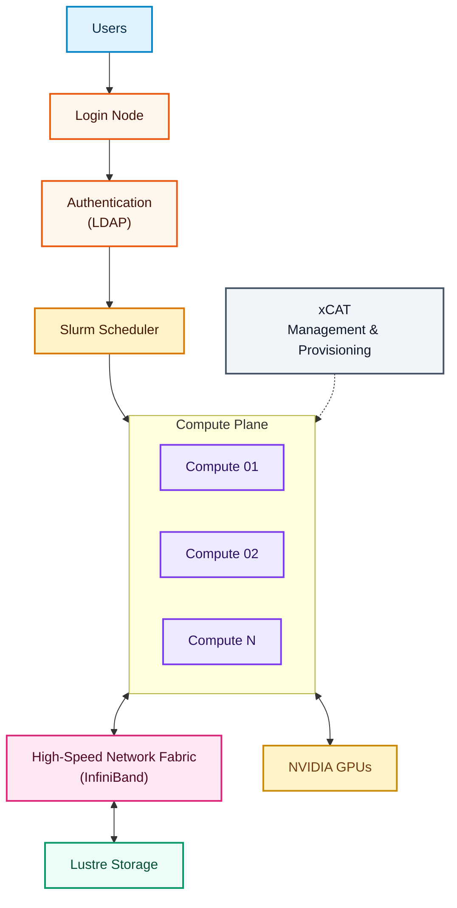
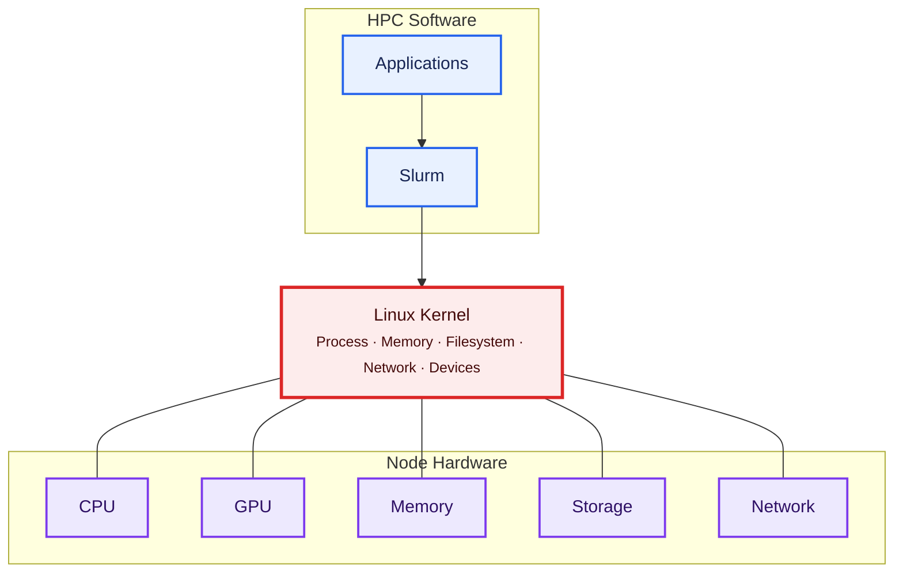
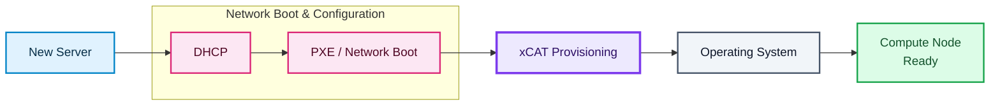
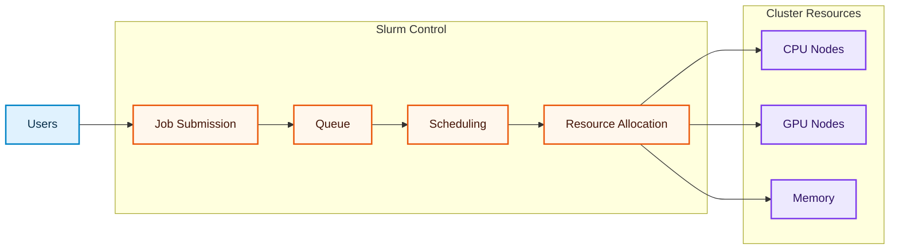
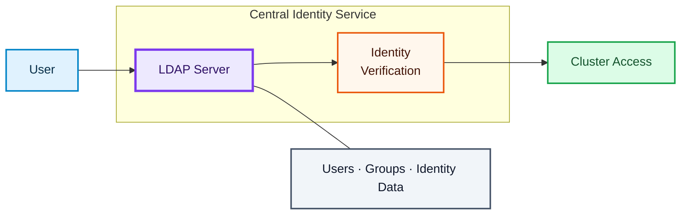
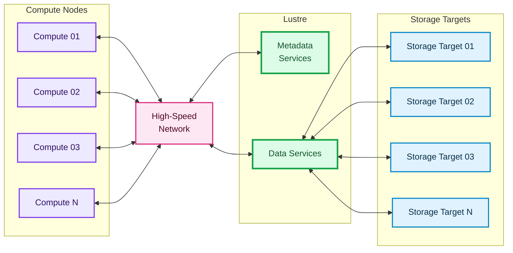
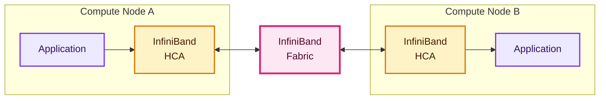
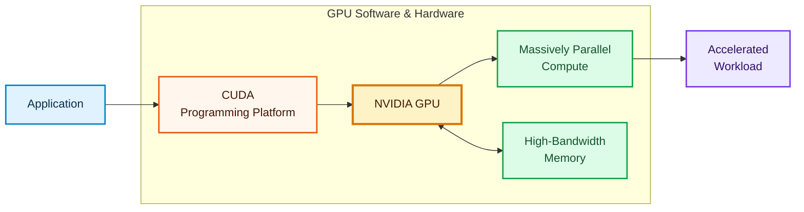

# Part 3 – Core HPC Technologies

* [3.1 Introduction](#31-introduction)
* [3.2 Linux](#32-linux)
* [3.3 xCAT Provisioning](#33-xcat-provisioning)
* [3.4 Slurm Workload Manager](#34-slurm-workload-manager)
* [3.5 LDAP Authentication](#35-ldap-authentication)
* [3.6 Lustre Parallel File System](#36-lustre-parallel-file-system)
* [3.7 InfiniBand Network Fabric](#37-infiniband-network-fabric)
* [3.8 NVIDIA GPU Computing](#38-nvidia-gpu-computing)
* [3.9 How Everything Works Together](#39-how-everything-works-together)
* [Production Insight](#production-insight)
* [Key Takeaways](#key-takeaways)

---

# 3.1 Introduction

An HPC cluster is not built around a single technology.

Instead, it is an ecosystem composed of specialized components, where each technology solves a specific infrastructure problem.

A simplified production architecture looks like this:

Each component has a clearly defined responsibility.

Understanding those responsibilities is one of the most important skills of an HPC Infrastructure Engineer.

---

# 3.2 Linux

## Purpose

Linux is the operating system that runs nearly every modern HPC cluster.

It provides:

* Process management
* Memory management
* Storage management
* Network management
* Security
* Hardware drivers

Without Linux, none of the higher-level HPC software could function.

---

## Why Linux?

Linux offers:

* Stability
* Performance
* Scalability
* Open-source ecosystem
* Excellent networking support
* NUMA awareness
* Container support
* GPU support

These characteristics make Linux the preferred operating system for supercomputers.

---

## Linux in an HPC Cluster

Linux is responsible for managing every hardware resource.

---

## Responsibilities

Linux manages:

* User sessions
* Running processes
* CPU scheduling
* Memory allocation
* Filesystems
* Network interfaces
* Device drivers

Every compute node, login node, and management node runs Linux.

---

## Why Linux Knowledge Matters

An HPC Infrastructure Engineer spends a significant portion of time troubleshooting Linux.

Examples include:

* High CPU utilization
* Memory leaks
* Disk bottlenecks
* Service failures
* Kernel panics
* Driver issues

The Linux chapter later in this handbook explores these topics in depth.

---

# 3.3 xCAT Provisioning

## Purpose

Managing hundreds or thousands of servers manually is impractical.

xCAT automates:

* Node discovery
* Operating system installation
* Network boot
* Cluster provisioning
* Configuration management
* Hardware inventory

---

## Provisioning Workflow

---

## Responsibilities

xCAT manages:

* Compute nodes
* Node definitions
* Operating system images
* Boot configuration
* Provisioning
* Remote power control
* Cluster inventory

---

## Why Provisioning Matters

Without provisioning software:

* Every server requires manual installation.
* Cluster expansion becomes slow.
* Recovery after hardware replacement becomes difficult.
* Configuration consistency is lost.

Provisioning enables rapid deployment and consistent configuration.

---

# 3.4 Slurm Workload Manager

## Purpose

Multiple users share the same cluster.

Slurm ensures resources are allocated fairly and efficiently.

---

## What Slurm Does

---

## Responsibilities

Slurm manages:

* Job scheduling
* Queue management
* Resource allocation
* Accounting
* Partitions
* Reservations
* Fair-share policies
* GPU scheduling

---

## Why Scheduling Matters

Imagine 500 users trying to execute workloads simultaneously.

Without a scheduler:

* Resources would conflict.
* Some users would monopolize the cluster.
* GPUs would remain underutilized.
* Large jobs would interfere with small jobs.

Slurm solves these operational challenges.

---

# 3.5 LDAP Authentication

## Purpose

An HPC cluster may support hundreds or thousands of users.

Managing local accounts independently on every node is not practical.

LDAP provides centralized authentication.

---

## Authentication Flow

---

## Responsibilities

LDAP manages:

* Users
* Groups
* Authentication
* Identity information

Other services use LDAP as the central source of user information.

---

## Benefits

* Centralized user management
* Consistent identities
* Simplified administration
* Easier security management

---

# 3.6 Lustre Parallel File System

## Purpose

Traditional filesystems are not designed for thousands of compute nodes accessing the same files simultaneously.

Lustre solves this problem.

---

## Storage Architecture

---

## Responsibilities

Lustre provides:

* Shared storage
* Parallel access
* High throughput
* Large capacity
* Scalability

---

## Why Parallel Storage?

Scientific workloads often:

* Read terabytes of input
* Generate terabytes of output
* Require simultaneous access from many nodes

Traditional NAS systems become bottlenecks.

Parallel filesystems eliminate these limitations.

---

# 3.7 InfiniBand Network Fabric

## Purpose

The network is responsible for communication between compute nodes.

Scientific applications exchange enormous volumes of data during execution.

InfiniBand provides:

* Low latency
* High bandwidth
* RDMA
* Efficient CPU utilization

---

## Communication Path

---

## Responsibilities

InfiniBand carries:

* MPI traffic
* Storage traffic
* GPU communication
* Cluster synchronization

---

## Why Low Latency?

Many HPC applications perform frequent synchronization.

Even small communication delays can significantly increase total execution time.

InfiniBand minimizes this overhead.

---

# 3.8 NVIDIA GPU Computing

## Purpose

Modern AI and many scientific applications require more computational throughput than CPUs alone can provide.

GPUs accelerate massively parallel workloads.

---

## GPU Workflow

---

## Responsibilities

GPUs accelerate:

* Deep learning
* Matrix operations
* Scientific simulations
* Image processing
* Data analytics

---

## GPU in AI

Large AI models depend on:

* Thousands of CUDA cores
* High-bandwidth memory
* GPU-to-GPU communication
* Distributed training

GPU computing has transformed modern HPC into AI infrastructure.

---

# 3.9 How Everything Works Together

The following diagram illustrates the interaction of all major HPC technologies.

```mermaid
flowchart LR

    %% ACCESS
    subgraph Access["User Access"]
        direction TB
        U["User"]
        L["Login Node"]
        A["LDAP Authentication"]
        S["Slurm Scheduler"]

        U --> L
        L --> A
        A --> S
    end

    %% COMPUTE
    subgraph Compute["Compute Cluster"]
        direction LR
        C1["Compute01"]
        C2["Compute02"]
        CN["ComputeN"]

        C1 --- C2
        C2 --- CN
    end

    %% OPERATING SYSTEM
    subgraph OS["Linux Operating System"]
        direction TB
        Linux["Linux OS"]
    end

    %% SYSTEM
    subgraph Machine["System / Machine"]
        direction LR
        CPU["CPU"]
        GPU["NVIDIA GPU"]
        MEM["Memory"]

        CPU --- GPU
        GPU --- MEM
    end

    %% NETWORK AND STORAGE
    subgraph Network["Network / Storage"]
        direction TB
        IB["InfiniBand Network Fabric"]
        Lustre["Lustre Parallel Storage"]
        XCT["Managed by xCAT"]

        IB --> Lustre
        XCT --> Lustre
    end

    %% MAIN CONNECTIONS
    Access --> Compute
    Compute --> OS
    OS --> Machine
    Machine --> Network

    %% COLORS
    style Access fill:#172554,stroke:#60a5fa,color:#ffffff
    style Compute fill:#064e3b,stroke:#34d399,color:#ffffff
    style OS fill:#334155,stroke:#94a3b8,color:#ffffff
    style Machine fill:#334155,stroke:#94a3b8,color:#ffffff
    style Network fill:#0f172a,stroke:#64748b,color:#ffffff

    style U fill:#1e293b,stroke:#38bdf8,color:#ffffff
    style L fill:#1e3a5f,stroke:#60a5fa,color:#ffffff
    style A fill:#1e3a5f,stroke:#60a5fa,color:#ffffff
    style S fill:#312e81,stroke:#818cf8,color:#ffffff

    style C1 fill:#065f46,stroke:#34d399,color:#ffffff
    style C2 fill:#065f46,stroke:#34d399,color:#ffffff
    style CN fill:#065f46,stroke:#34d399,color:#ffffff

    style Linux fill:#475569,stroke:#cbd5e1,color:#ffffff

    style CPU fill:#475569,stroke:#cbd5e1,color:#ffffff
    style GPU fill:#475569,stroke:#cbd5e1,color:#ffffff
    style MEM fill:#475569,stroke:#cbd5e1,color:#ffffff

    style IB fill:#164e63,stroke:#22d3ee,color:#ffffff
    style Lustre fill:#581c87,stroke:#c084fc,color:#ffffff
    style XCT fill:#713f12,stroke:#fbbf24,color:#ffffff

```

Every component has a dedicated role.

Together, they provide:

* Compute
* Scheduling
* Authentication
* Provisioning
* Storage
* Networking
* GPU acceleration

Removing any one of these components would significantly reduce the capability of the cluster.

---

# Production Insight

Experienced HPC engineers rarely troubleshoot a single technology in isolation.

For example:

* A Slurm job may remain pending because GPUs are unavailable.
* A Lustre outage may cause running jobs to fail with I/O errors.
* An LDAP issue may prevent users from logging into the cluster.
* An InfiniBand failure may dramatically slow MPI applications.
* A Linux kernel driver issue may prevent NVIDIA GPUs from being detected.

Understanding the relationships between these technologies is more valuable than memorizing individual commands.

---

# Key Takeaways

* Linux is the foundation of every HPC cluster.
* xCAT automates provisioning and lifecycle management.
* Slurm manages workload scheduling and resource allocation.
* LDAP provides centralized authentication.
* Lustre delivers high-performance shared storage.
* InfiniBand enables low-latency communication.
* NVIDIA GPUs accelerate AI and scientific workloads.
* Together, these technologies form the core infrastructure of modern HPC and AI clusters.

---

## Next Part

**Part 4 – OpenCHAI Vision, Skills Roadmap, Best Practices, Interview Questions, Glossary, and Chapter Summary**
