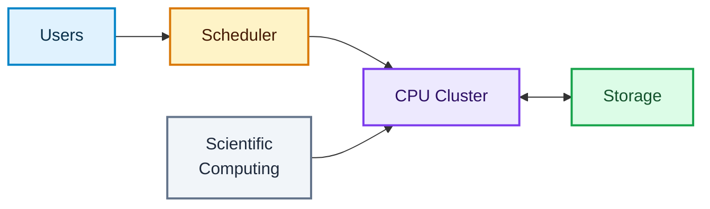
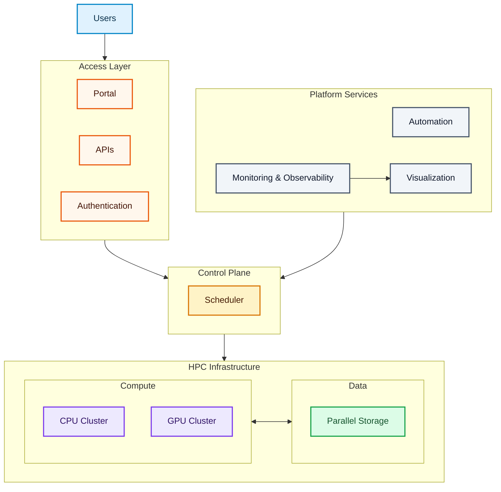
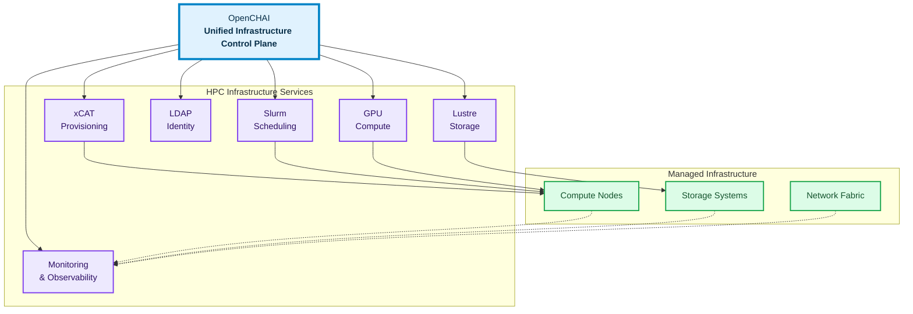
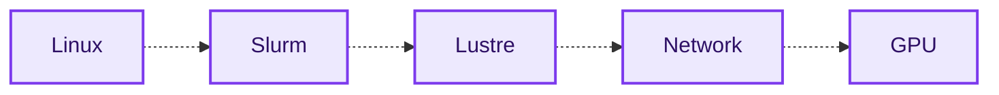
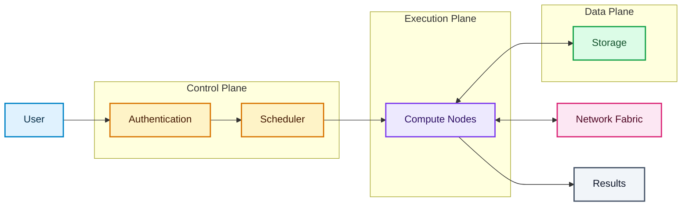

# Part 4 – OpenCHAI Vision, Skills Roadmap, Best Practices, Interview Preparation & Chapter Summary

* [4.1 From HPC Clusters to HPC Platforms](https://chatgpt.com/#41-from-hpc-clusters-to-hpc-platforms)
* [4.2 OpenCHAI Vision](https://chatgpt.com/#42-openchai-vision)
* [4.3 Skills Roadmap for an HPC-AI Infrastructure Engineer](https://chatgpt.com/#43-skills-roadmap-for-an-hpc-ai-infrastructure-engineer)
* [4.4 Engineering Mindset](https://chatgpt.com/#44-engineering-mindset)
* [4.5 Best Practices](https://chatgpt.com/#45-best-practices)
* [4.6 Common Beginner Mistakes](https://chatgpt.com/#46-common-beginner-mistakes)
* [4.7 Interview Questions](https://chatgpt.com/#47-interview-questions)
* [4.8 Glossary](https://chatgpt.com/#48-glossary)
* [4.9 Chapter Summary](https://chatgpt.com/#49-chapter-summary)
* [Next Chapter](https://chatgpt.com/#next-chapter)

---

# 4.1 From HPC Clusters to HPC Platforms

Historically, HPC clusters were designed primarily for scientific simulations.

Typical workloads included:

* Computational Fluid Dynamics (CFD)
* Weather Forecasting
* Molecular Dynamics
* Finite Element Analysis (FEA)
* Seismic Processing

Modern computing has introduced new workload types.

Today's infrastructure is expected to support:

* Artificial Intelligence
* Machine Learning
* Large Language Models (LLMs)
* Computer Vision
* Bioinformatics
* Data Analytics
* Digital Twins

As a result, modern HPC clusters are evolving into complete **HPC-AI Platforms** rather than simple compute clusters.

---

## Traditional HPC



**Primary workload:** Scientific Computing

The scheduler allocates compute resources, while the compute nodes execute workloads and access shared storage.

---
## Modern HPC-AI Platform



### Architecture Meaning

The diagram now has **four clear architectural layers**:

**1. Access Layer**

Users enter the platform through:

* Portal
* APIs
* Authentication

**2. Control Plane**

The scheduler controls workload placement and resource allocation.

**3. HPC Infrastructure**

The actual infrastructure is divided into:

* **Compute:** CPU and GPU resources
* **Data:** Parallel storage

Compute resources interact with shared storage.

**4. Platform Services**

Platform-level services provide:

* Automation
* Monitoring and observability
* Visualization

The important design principle is:

> **Users → Access → Control Plane → HPC Infrastructure**

Platform services operate **across the platform** rather than being inserted into the workload execution path.

This keeps the diagram architectural instead of turning it into a web of arrows.


Modern platforms integrate compute, storage, networking, access, automation, monitoring, and visualization into a unified operational environment.

The dashed connections represent **management, automation, or observability relationships**, rather than direct workload execution paths.

---
# 4.2 OpenCHAI Vision

## The Next Generation of HPC Infrastructure

Operating a large HPC environment requires multiple technologies working together across different layers of the infrastructure.

A better way to understand this environment is to group the technologies by their **architectural responsibility** rather than connecting every component directly.

```mermaid


flowchart TB

    USERS["Users & Administrators"]

    subgraph CONTROL["Control & Management Plane"]
        direction LR

        subgraph ACCESS["Identity & Access"]
            direction LR
            LDAP["LDAP<br/>Identity & Authentication"]
        end

        subgraph MGMT["Cluster Management"]
            direction LR
            XCAT["xCAT<br/>Provisioning"]
        end

        subgraph SCHED["Workload Management"]
            direction LR
            SLURM["Slurm<br/>Scheduling"]
        end
    end

    subgraph HPC["HPC Infrastructure"]
        direction LR

        subgraph COMPUTE["Compute Layer"]
            direction LR
            GPU["GPU<br/>Accelerated Compute"]
        end

        subgraph DATA["Storage Layer"]
            direction LR
            LUSTRE["Lustre<br/>Parallel File System"]
        end

        subgraph FABRIC["Network Layer"]
            direction LR
            IB["InfiniBand<br/>High-Speed Fabric"]
        end

        subgraph OS["System Layer"]
            direction LR
            LINUX["Linux"]
        end
    end

    subgraph OPERATIONS["Operations & Observability"]
        direction LR
        MON["Monitoring &<br/>Observability"]
    end

    USERS --> CONTROL
    CONTROL --> HPC
    HPC --> OPERATIONS

    classDef users fill:#E0F2FE,stroke:#0284C7,color:#082F49,stroke-width:3px

    classDef control fill:#FFF7ED,stroke:#EA580C,color:#431407,stroke-width:2px
    classDef identity fill:#FFEDD5,stroke:#EA580C,color:#7C2D12,stroke-width:2px
    classDef management fill:#EDE9FE,stroke:#7C3AED,color:#2E1065,stroke-width:2px
    classDef scheduler fill:#FEF3C7,stroke:#D97706,color:#451A03,stroke-width:2px

    classDef infrastructure fill:#F8FAFC,stroke:#64748B,color:#1E293B,stroke-width:2px
    classDef compute fill:#EDE9FE,stroke:#7C3AED,color:#2E1065,stroke-width:2px
    classDef storage fill:#DCFCE7,stroke:#16A34A,color:#14532D,stroke-width:2px
    classDef network fill:#FCE7F3,stroke:#DB2777,color:#500724,stroke-width:2px
    classDef os fill:#FDECEC,stroke:#DC2626,color:#450A0A,stroke-width:2px

    classDef operations fill:#E0F2FE,stroke:#0284C7,color:#082F49,stroke-width:3px

    class USERS users

    class LDAP identity
    class XCAT management
    class SLURM scheduler

    class GPU compute
    class LUSTRE storage
    class IB network
    class LINUX os

    class MON operations

```



### Architectural Structure

The diagram separates the platform into **three major architectural domains**.

### 1. Control & Management Plane

This layer manages and coordinates the HPC environment.

It contains:

* **Identity & Access**

  * LDAP
* **Cluster Management**

  * xCAT
* **Workload Management**

  * Slurm

These components determine **who can access the platform, how infrastructure is provisioned, and how workloads are scheduled**.

---

### 2. HPC Infrastructure

This is the actual infrastructure on which workloads execute.

The infrastructure is further divided into four logical layers:

```text
HPC Infrastructure
│
├── Compute
│   └── GPU
│
├── Storage
│   └── Lustre
│
├── Network
│   └── InfiniBand
│
└── System
    └── Linux
```

This grouping is important because these technologies have different responsibilities:

* **Linux** provides the operating-system foundation.
* **GPU** provides accelerated compute resources.
* **Lustre** provides parallel data storage.
* **InfiniBand** provides high-speed communication between systems.

---

### 3. Operations & Observability

Monitoring sits outside the core infrastructure because it does not provide compute, storage, or networking resources.

Instead, it provides visibility into the entire platform:

```text
                Operations & Observability
                         │
                    Monitoring
                         │
          ┌──────────────┼──────────────┐
          ↓              ↓              ↓
       Compute         Storage        Network
```

This distinction makes the architecture easier to understand.

---

## Architectural Relationship

The high-level relationship can therefore be summarized as:

```text
                Users & Administrators
                         │
                         ▼
              ┌─────────────────────┐
              │ Control & Management │
              │                     │
              │ LDAP · xCAT · Slurm │
              └──────────┬──────────┘
                         │
                         ▼
              ┌─────────────────────┐
              │  HPC Infrastructure │
              │                     │
              │ Compute             │
              │ Storage             │
              │ Network             │
              │ System              │
              └──────────┬──────────┘
                         │
                         ▼
              ┌─────────────────────┐
              │    Observability    │
              │     Monitoring      │
              └─────────────────────┘
```

The important point is that these are **architectural relationships**, not a literal execution pipeline.

The purpose of the diagram is to show **where each technology belongs and what responsibility it provides**.

This layered organization provides the foundation for the **OpenCHAI vision**: a unified control plane that can coordinate provisioning, identity, scheduling, infrastructure, and observability without requiring administrators to operate each technology as an isolated system.


Each technology solves a specific problem.

Traditionally, administrators interact with each component independently. In a production HPC environment, however, these technologies must work together.

The dashed arrows represent **integration, dependency, or observability relationships**, rather than a strict linear execution sequence.

---

## The Challenge

Without a unified platform, administrators often perform tasks using multiple tools.

A simplified operational workflow might look like this:


This represents a **simplified operational sequence**, not a strict technical dependency chain. In practice, many of these activities can occur in parallel or be managed through automated workflows.

Managing each component individually becomes increasingly complex as clusters grow.

---

## OpenCHAI Concept

The vision is to provide a unified infrastructure control plane that coordinates these technologies through a single interface.

Conceptually:



Instead of replacing existing HPC technologies, the control plane orchestrates and integrates them into a consistent operational workflow.

The key distinction is:

**OpenCHAI is the control and orchestration layer; the underlying HPC technologies remain responsible for their specialized functions.**

---

## Why This Matters

Benefits include:

* Simplified operations
* Consistent automation
* Faster deployments
* Reduced operational complexity
* Better observability
* Easier lifecycle management
* Consistent configuration
* Improved operational scalability

The detailed architecture is discussed in later chapters.

---

# 4.3 Skills Roadmap for an HPC-AI Infrastructure Engineer

Building expertise requires mastering technologies in a logical sequence.

```mermaid
flowchart LR

    FOUNDATION["Foundation<br/>Linux · Bash · Networking"]

    INFRA["Infrastructure<br/>Storage · Provisioning · Authentication"]

    SCHED["Scheduling<br/>Slurm"]

    PERFORMANCE["Performance<br/>CPU · NUMA · GPU · CUDA"]

    FABRIC["High-Speed Fabric<br/>InfiniBand · RDMA · NCCL"]

    AUTOMATION["Automation<br/>Python · Ansible · APIs"]

    PLATFORM["Platform Engineering<br/>Containers · Observability · HA"]

    ARCH["Architecture<br/>Infrastructure Design"]

    FOUNDATION --> INFRA
    INFRA --> SCHED
    SCHED --> PERFORMANCE
    PERFORMANCE --> FABRIC
    FABRIC --> AUTOMATION
    AUTOMATION --> PLATFORM
    PLATFORM --> ARCH

    classDef foundation fill:#E0F2FE,stroke:#0284C7,color:#082F49,stroke-width:2px
    classDef infra fill:#EDE9FE,stroke:#7C3AED,color:#2E1065,stroke-width:2px
    classDef sched fill:#FEF3C7,stroke:#D97706,color:#451A03,stroke-width:2px
    classDef performance fill:#FCE7F3,stroke:#DB2777,color:#500724,stroke-width:2px
    classDef fabric fill:#DCFCE7,stroke:#16A34A,color:#14532D,stroke-width:2px
    classDef automation fill:#FFF7ED,stroke:#EA580C,color:#431407,stroke-width:2px
    classDef platform fill:#F1F5F9,stroke:#475569,color:#0F172A,stroke-width:2px
    classDef architecture fill:#DBEAFE,stroke:#1D4ED8,color:#172554,stroke-width:3px

    class FOUNDATION foundation
    class INFRA infra
    class SCHED sched
    class PERFORMANCE performance
    class FABRIC fabric
    class AUTOMATION automation
    class PLATFORM platform
    class ARCH architecture
```



---

## Phase 1 — Foundation

Topics:

* Linux
* Bash
* Networking
* System Administration
* Storage
* Git

**Goal:** Become comfortable administering Linux systems.

---

## Phase 2 — Infrastructure

Topics:

* LDAP
* xCAT
* PXE
* DHCP
* DNS
* Slurm
* Lustre

**Goal:** Operate an HPC cluster.

---

## Phase 3 — Performance

Topics:

* CPU Architecture
* NUMA
* GPU Computing
* CUDA
* NCCL
* InfiniBand
* RDMA

**Goal:** Understand performance optimization.

---

## Phase 4 — Automation

Topics:

* Bash
* Python
* Ansible
* REST APIs
* Containers

**Goal:** Reduce manual administration.

---

## Phase 5 — Platform Engineering

Topics:

* Infrastructure Design
* High Availability
* Monitoring
* Security
* Automation
* Platform Architecture

**Goal:** Design production-ready HPC platforms.

---

# 4.4 Engineering Mindset

Infrastructure engineering is different from application development.

A platform engineer focuses on:

* Reliability
* Scalability
* Availability
* Security
* Automation
* Repeatability
* Observability

Rather than asking:

> "How do I install this software?"

An infrastructure engineer asks:

> "How do I deploy, monitor, secure, automate, upgrade, and recover this service across hundreds of nodes?"

---

## Think in Systems

Instead of viewing technologies independently:



Think in terms of relationships, dependencies, data paths, and operational responsibilities.

---

## Think in Terms of Control, Execution, and Data



Understanding these interactions is the foundation of effective troubleshooting.

---

# 4.5 Best Practices

## Documentation

Always document:

* Architecture
* Configuration
* Changes
* Procedures
* Recovery steps

Documentation is part of engineering, not an afterthought.

---

## Automation

Avoid repetitive manual tasks.

Automate whenever possible.

Examples include:

* Node provisioning
* User management
* Configuration deployment
* Software installation
* Health checks

Automation improves consistency and reduces operational risk.

---

## Monitoring

Monitor continuously:

* CPU utilization
* Memory usage
* Disk capacity
* GPU utilization
* Network performance
* Scheduler health
* Storage throughput

Monitoring enables proactive maintenance.

---

## Security

Follow the principle of least privilege.

Recommendations:

* Use centralized authentication.
* Disable unnecessary services.
* Keep systems updated.
* Audit administrative actions.
* Protect management interfaces.

---

## High Availability

Critical services should avoid single points of failure.

Examples include:

* Scheduler
* Authentication
* Provisioning
* Monitoring
* Storage
* Databases

Design for failure rather than assuming components will always be available.

---

## Change Management

Before making production changes:

* Understand the impact.
* Test in a lab environment.
* Schedule maintenance windows when required.
* Maintain rollback procedures.
* Verify the outcome.

---

# 4.6 Common Beginner Mistakes

Avoid these common pitfalls.

### Focusing Only on Commands

Understanding architecture is more valuable than memorizing syntax.

---

### Ignoring Networking

Many cluster issues originate from network configuration rather than application code.

---

### Running Workloads on Login Nodes

Login nodes are intended for interactive tasks, development, job submission, and lightweight management activities—not large computations.

---

### Skipping Documentation

Unrecorded changes become difficult to troubleshoot later.

---

### Troubleshooting by Guessing

Avoid changing multiple variables simultaneously.

Instead:

1. Observe
2. Collect evidence
3. Form a hypothesis
4. Test
5. Validate

---

### Neglecting Automation

Manual procedures become error-prone as clusters grow.

---

# 4.7 Interview Questions

## Fundamental Questions

1. What is High Performance Computing?
2. Why is HPC important?
3. What problems does HPC solve?
4. Explain parallel computing.
5. Explain distributed computing.
6. Differentiate vertical and horizontal scaling.
7. Why are GPUs important for AI?
8. Why is InfiniBand preferred over Ethernet for many HPC workloads?
9. What is the purpose of a workload manager?
10. Why is centralized authentication important?

---

## Architecture Questions

1. Describe the architecture of a typical HPC cluster.
2. Explain the role of Linux in an HPC environment.
3. Why is shared storage required?
4. How does job scheduling work?
5. What components are involved in executing an AI training job?

---

## Scenario Questions

* A user cannot log in. Where would you investigate?
* Jobs remain pending. What components would you verify?
* GPUs are not visible on compute nodes. What are possible causes?
* Applications report I/O errors. Which storage components should be examined?
* MPI jobs are running slowly. What network-related factors would you investigate?

---

# 4.8 Glossary

| Term                  | Definition                                                                                                            |
| --------------------- | --------------------------------------------------------------------------------------------------------------------- |
| HPC                   | High Performance Computing                                                                                            |
| Cluster               | A group of interconnected computers working together                                                                  |
| Node                  | An individual server within a cluster                                                                                 |
| Login Node            | Entry point for users                                                                                                 |
| Compute Node          | Executes workloads                                                                                                    |
| Scheduler             | Allocates cluster resources to workloads                                                                              |
| Slurm                 | Popular HPC workload manager and scheduler                                                                            |
| xCAT                  | Cluster provisioning and management software                                                                          |
| LDAP                  | Directory service commonly used for centralized identity management                                                   |
| Lustre                | Parallel distributed file system                                                                                      |
| GPU                   | Graphics Processing Unit used for accelerated computing                                                               |
| CUDA                  | NVIDIA parallel computing platform and programming model                                                              |
| RDMA                  | Remote Direct Memory Access                                                                                           |
| InfiniBand            | High-speed, low-latency networking technology commonly used in HPC                                                    |
| Parallel Computing    | Simultaneous execution of multiple computational tasks                                                                |
| Distributed Computing | Execution of workloads across multiple interconnected computers                                                       |
| Provisioning          | Preparing systems for operational use                                                                                 |
| High Availability     | Designing systems to minimize service downtime                                                                        |
| Observability         | Ability to understand system behavior through metrics, logs, traces, and other telemetry                              |
| Control Plane         | Components responsible for managing, scheduling, and coordinating infrastructure                                      |
| Data Plane            | Components responsible for carrying or processing workload data                                                       |
| NUMA                  | Non-Uniform Memory Access architecture in which memory access latency depends on its location relative to a processor |
| NCCL                  | NVIDIA Collective Communications Library used for high-performance GPU communication                                  |

---

# 4.9 Chapter Summary

This chapter introduced the fundamental concepts that underpin High Performance Computing and modern AI infrastructure.

We examined:

* Why HPC exists.
* How computing evolved toward distributed systems.
* The architecture of a modern HPC cluster.
* The major technologies that form the HPC software stack.
* The responsibilities of Linux, provisioning, scheduling, authentication, storage, networking, and GPU acceleration.
* The evolution from traditional HPC clusters to integrated HPC-AI platforms.
* The engineering mindset required to build and operate production infrastructure.
* Best practices for documentation, automation, monitoring, security, and operational excellence.

The remaining chapters build upon this foundation by exploring each technology in depth.

---

# Key Takeaways

* HPC is an integrated platform rather than a collection of independent technologies.
* Successful infrastructure engineers understand how components interact.
* Modern AI infrastructure extends traditional HPC by incorporating GPU acceleration, automation, and platform engineering.
* Strong fundamentals in Linux, networking, storage, provisioning, scheduling, and automation are essential.
* Architecture and systems thinking are more valuable than memorizing commands.
* Observability, automation, security, and high availability are essential characteristics of production infrastructure.

---

# Next Chapter

# Chapter 2 – Linux

Topics include:

* Linux Architecture
* Boot Process
* Process Management
* Memory Management
* Filesystems
* Storage
* Networking
* Services
* Performance Monitoring
* System Administration
* Troubleshooting
* Essential Commands

The Linux chapter establishes the operating system knowledge required before exploring provisioning, scheduling, storage, and networking in greater depth.
