# Part 5 – Advanced HPC Concepts

* [5.1 HPC vs Cloud Computing](#51-hpc-vs-cloud-computing)
* [5.2 HPC vs AI Infrastructure](#52-hpc-vs-ai-infrastructure)
* [5.3 AI Factory Architecture](#53-ai-factory-architecture)
* [5.4 Complete Anatomy of an HPC Cluster](#54-complete-anatomy-of-an-hpc-cluster)
* [5.5 End-to-End HPC Workflow](#55-end-to-end-hpc-workflow)
* [5.6 Control Plane vs Data Plane](#56-control-plane-vs-data-plane)
* [5.7 Modern HPC Control Plane](#57-modern-hpc-control-plane)
* [5.8 Final Chapter Summary](#58-final-chapter-summary)

---

# 5.1 HPC vs Cloud Computing

## Introduction

One of the most common misconceptions is that **High Performance Computing (HPC)** and **Cloud Computing** are the same.

They are not.

Although both consist of many servers working together, they were designed to solve different problems and optimize different performance characteristics.

Understanding these differences is essential when designing infrastructure for scientific computing or artificial intelligence.

---

## HPC

HPC is designed to solve **one very large computational problem** by allowing many compute nodes to work together simultaneously.

Typical workloads include:

* Computational Fluid Dynamics (CFD)
* Molecular Dynamics
* Weather Forecasting
* Finite Element Analysis
* Genome Sequencing
* AI Model Training

Characteristics:

* Extremely low latency
* High bandwidth communication
* Parallel processing
* Dedicated infrastructure
* Optimized hardware

---

## Cloud Computing

Cloud computing focuses on delivering computing resources as a service.

Typical workloads include:

* Web applications
* APIs
* Databases
* Virtual machines
* Microservices
* Object storage

Characteristics:

* Elastic scaling
* Self-service provisioning
* Multi-tenancy
* Pay-as-you-go pricing
* Geographic distribution

---

## Architectural Comparison

### HPC

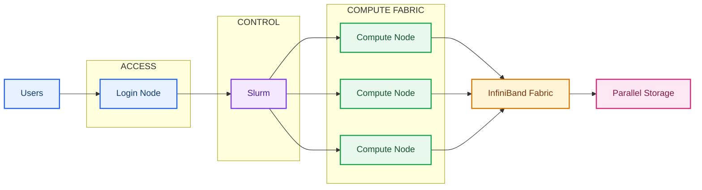

---

### Cloud

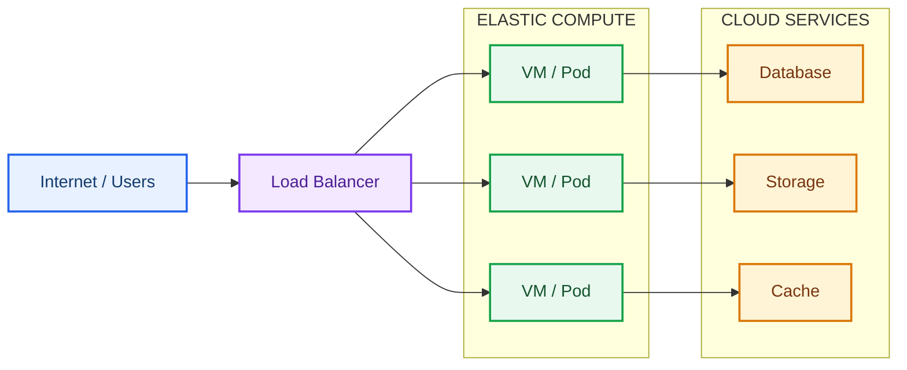

---

## Comparison

| HPC                  | Cloud                   |
| -------------------- | ----------------------- |
| Performance-first    | Flexibility-first       |
| Dedicated hardware   | Shared infrastructure   |
| Low latency          | Internet latency        |
| MPI communication    | REST communication      |
| Scientific workloads | Enterprise applications |
| GPU clusters         | Virtual infrastructure  |
| Parallel storage     | Object / Block storage  |

---

## Can AI Run on Both?

Yes.

AI workloads can execute on:

* On-prem HPC clusters
* Public cloud platforms
* Hybrid environments

The choice depends on:

* Cost
* Performance
* Data locality
* Security
* GPU availability

---

# 5.2 HPC vs AI Infrastructure

Artificial Intelligence has significantly changed modern HPC architectures.

Traditional HPC focused primarily on CPUs.

Modern AI infrastructure is centered around GPUs.

---

## Traditional HPC

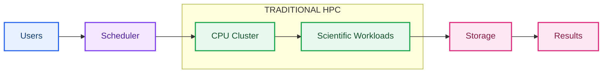

Primary workloads:

* Scientific simulations
* Numerical analysis
* Engineering computation

---

## AI Infrastructure

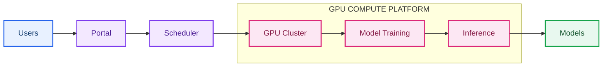

Primary workloads:

* Deep Learning
* LLM Training
* Reinforcement Learning
* Computer Vision
* Speech Recognition

---

## Infrastructure Differences

| Traditional HPC         | AI Infrastructure |
| ----------------------- | ----------------- |
| CPU intensive           | GPU intensive     |
| MPI workloads           | CUDA workloads    |
| Moderate datasets       | Massive datasets  |
| Scientific applications | AI frameworks     |
| Simulation              | Model training    |

---

## Common Components

Both environments require:

* Linux
* Authentication
* Scheduler
* Shared Storage
* Monitoring
* Automation
* High-speed Networking

The difference lies in workload characteristics rather than infrastructure fundamentals.

---

# 5.3 AI Factory Architecture

## Concept

An **AI Factory** is an infrastructure platform designed to continuously transform data into trained AI models and deploy them for inference.

It combines:

* Data
* Compute
* Storage
* Networking
* Scheduling
* Automation
* Monitoring

into a single operational platform.

---

## AI Factory Workflow

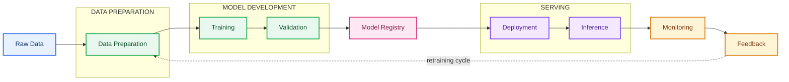

Unlike traditional HPC jobs, AI workloads are iterative and continuously evolve as new data becomes available.

---

## Infrastructure View

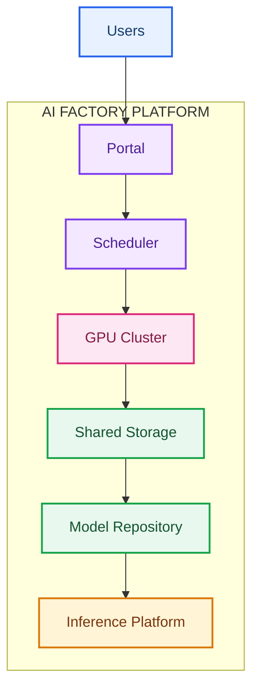

This architecture enables the complete machine learning lifecycle.

---

# 5.4 Complete Anatomy of an HPC Cluster

An HPC cluster consists of several specialized node types.

Each node performs a specific function.

---

## Complete Architecture

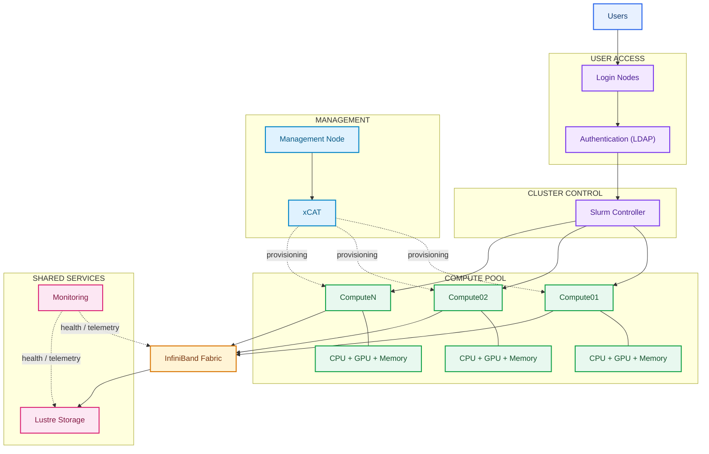

---

## Cluster Components

### Login Node

Purpose:

* User access
* Compilation
* Job submission

---

### Compute Nodes

Purpose:

* Execute workloads
* Consume allocated resources

---

### Management Node

Purpose:

* Provision systems
* Configure services
* Monitor infrastructure

---

### Storage

Purpose:

* Shared datasets
* User home directories
* Scratch space

---

### High-Speed Network

Purpose:

* MPI communication
* Storage traffic
* GPU communication

---

# 5.5 End-to-End HPC Workflow

The following illustrates the complete lifecycle of a workload.

```mermaid
flowchart LR

    classDef user fill:#E8F1FF,stroke:#2563EB,color:#123B6D,stroke-width:2px
    classDef control fill:#F3E8FF,stroke:#7C3AED,color:#4C1D95,stroke-width:2px
    classDef compute fill:#E8F8EF,stroke:#16A34A,color:#14532D,stroke-width:2px
    classDef data fill:#FCE7F3,stroke:#DB2777,color:#831843,stroke-width:2px
    classDef result fill:#FFF4D6,stroke:#D97706,color:#78350F,stroke-width:2px

    R["Researcher"]:::user

    subgraph ACCESS["ACCESS & PREPARATION"]
        SSH["SSH Login"]
        COMPILE["Compile Application"]
    end
    class SSH,COMPILE user

    subgraph SCHEDULING["SCHEDULING"]
        SUBMIT["Submit Job"]
        SCHED["Scheduler"]
        QUEUE["Queue"]
        ALLOC["Allocate Resources"]
    end
    class SUBMIT,SCHED,QUEUE,ALLOC control

    subgraph EXECUTION["COMPUTE"]
        C["Compute Nodes"]
        MEM["Memory"]
        ACC["CPU / GPU"]
    end
    class C,MEM,ACC compute

    subgraph DATA["DATA"]
        READ["Read Data"]
        WRITE["Write Results"]
        STORE["Parallel Storage"]
    end
    class READ,WRITE,STORE data

    DONE["Job Complete"]:::result

    R --> SSH
    SSH --> COMPILE
    COMPILE --> SUBMIT
    SUBMIT --> SCHED
    SCHED --> QUEUE
    QUEUE --> ALLOC
    ALLOC --> C

    READ --> C
    C --> MEM
    MEM --> ACC
    ACC --> WRITE
    WRITE --> STORE
    STORE --> DONE
```

Every infrastructure component participates in this workflow.

---

# 5.6 Control Plane vs Data Plane

Modern infrastructure is divided into two logical planes.

---

## Control Plane

Responsible for managing the cluster.

Examples:

* Authentication
* Provisioning
* Scheduling
* Monitoring
* Configuration

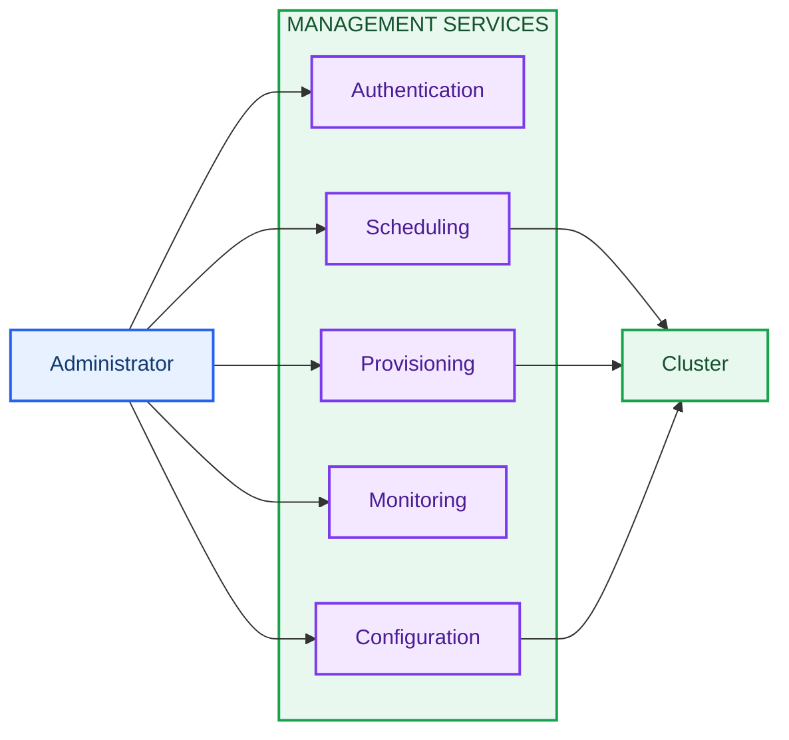

---

## Data Plane

Responsible for executing user workloads.

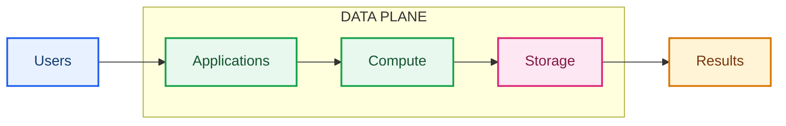

---

## Why Separate Them?

Benefits include:

* Better scalability
* Easier maintenance
* Improved security
* Independent upgrades
* Simplified troubleshooting

---

# 5.7 Modern HPC Control Plane

As clusters grow larger, manual administration becomes increasingly difficult.

Modern HPC environments rely on centralized control planes.

Typical responsibilities include:

* Node lifecycle management
* User management
* Job management
* Monitoring
* Health checking
* Software deployment
* Configuration management

A modern control plane provides a unified operational interface for the underlying HPC technologies.

---

## Conceptual Architecture

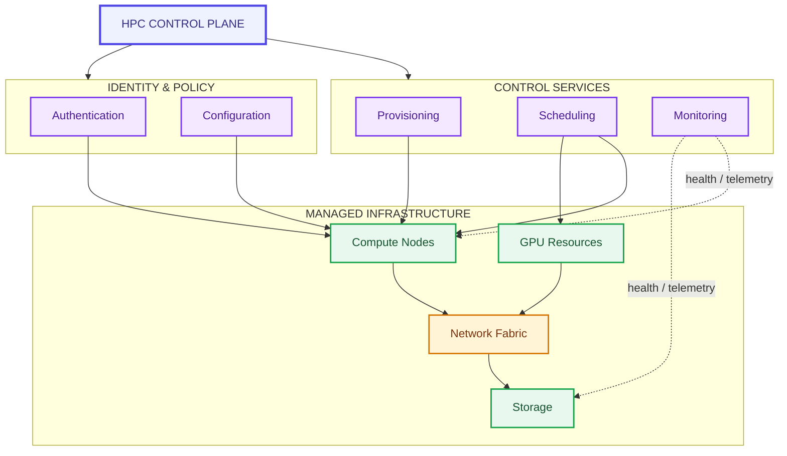

The control plane coordinates infrastructure services while the data plane executes workloads.

---

# 5.8 Final Chapter Summary

This chapter introduced the concepts required to understand modern HPC and AI infrastructure.

Topics covered include:

* High Performance Computing fundamentals
* Evolution of computing
* HPC software stack
* Job lifecycle
* Cluster architecture
* Core infrastructure technologies
* AI infrastructure
* AI Factory concepts
* Control plane architecture
* Responsibilities of an HPC Infrastructure Engineer

These concepts establish the foundation for the remaining chapters of this handbook.

---

# Chapter Completion Checklist

After completing this chapter, you should be able to answer:

* What is HPC?
* Why does HPC exist?
* How does an HPC cluster operate?
* What are the major components of an HPC cluster?
* How does a workload execute?
* What is the purpose of Linux in HPC?
* Why are GPUs important?
* What is Slurm?
* What is xCAT?
* What is Lustre?
* What is LDAP?
* Why is InfiniBand used?
* What is an AI Factory?
* What is the difference between HPC and Cloud?
* What is the difference between HPC and AI Infrastructure?
* What is a Control Plane?
* What is a Data Plane?

If you can confidently answer these questions, you have built the conceptual foundation required for the rest of this handbook.

---

# Next Chapter

# Chapter 2 – Linux

The next chapter explores Linux from the perspective of an HPC-AI Infrastructure Engineer.

Topics include:

* Linux Architecture
* Boot Process
* Process Management
* Memory Management
* Filesystems
* Storage
* Networking
* Services
* Security
* Performance
* Troubleshooting
* Essential Linux Commands
* Linux Interview Questions
