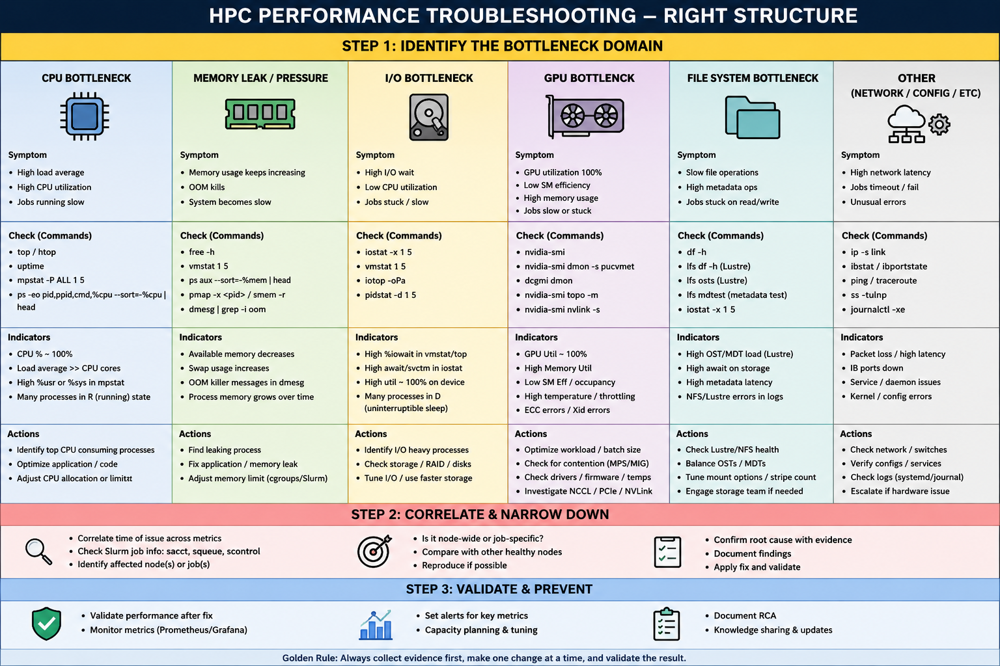

## Part 1 – Troubleshooting Methodology & Linux

> **Notebook focus:** A concise production troubleshooting workflow for HPC-AI infrastructure. Start with evidence, isolate the failing layer, fix safely, and validate.

* [17.1 Production Troubleshooting Mindset](#171-production-troubleshooting-mindset)
* [17.2 The 7-Step Troubleshooting Workflow](#172-the-7-step-troubleshooting-workflow)
* [17.3 Identify the Scope](#173-identify-the-scope)
* [17.4 Linux Troubleshooting Layers](#174-linux-troubleshooting-layers)
* [17.5 CPU Problems](#175-cpu-problems)
* [17.6 Memory Problems](#176-memory-problems)
* [17.7 Disk and I/O Problems](#177-disk-and-io-problems)
* [17.8 Process Problems](#178-process-problems)
* [17.9 Service Problems](#179-service-problems)
* [17.10 Kernel Problems](#1710-kernel-problems)
* [17.11 Production Checklist](#1711-production-checklist)
* [17.12 Quick Revision](#1712-quick-revision)
* [Bonus! HPC Performance Troubleshooting](#HPC-Performance-Troubleshooting-Right-Structure)

---

# 17.1 Production Troubleshooting Mindset

Production troubleshooting is not:

```text
Problem
  ↓
Restart everything
  ↓
Hope it works
```

Use:

```text
Problem
  ↓
Observe
  ↓
Collect evidence
  ↓
Isolate
  ↓
Fix
  ↓
Validate
  ↓
Document
```

The primary goal is:

> **Restore service while minimizing risk and preserving evidence.**

---

# 17.2 The 7-Step Troubleshooting Workflow

### 1. Detect

What is actually failing?

```text
Node?
Job?
GPU?
Network?
Storage?
Authentication?
```

### 2. Scope

Determine whether the problem affects:

```text
One process
One user
One node
Multiple nodes
One rack
One service
Entire cluster
```

### 3. Collect Evidence

```bash
date
hostname
uptime
```

Then inspect:

```bash
systemctl --failed
journalctl -p err
dmesg
```

### 4. Form a Hypothesis

Example:

```text
GPU job failed
     ↓
GPU unavailable
     ↓
Driver problem?
Slurm GRES problem?
GPU hardware problem?
```

### 5. Test

Run the smallest command that can confirm or reject the hypothesis.

### 6. Fix

Make the smallest safe change.

### 7. Validate

Confirm the original problem is actually resolved.

---

# 17.3 Identify the Scope

Scope is one of the most important troubleshooting skills.

Example:

```text
User reports:
"GPU jobs are failing."
```

Do not assume the entire GPU cluster is broken.

Test:

```text
GPU Node 1 → Failed
GPU Node 2 → Working
GPU Node 3 → Working
```

Likely:

```text
Node-specific problem
```

Another case:

```text
GPU Node 1 → Failed
GPU Node 2 → Failed
GPU Node 3 → Failed
```

Now investigate shared infrastructure:

```text
Driver
Image
Slurm configuration
Network
Storage
Common software stack
```

---

# 17.4 Linux Troubleshooting Layers

Use this model:

```text
Application
     ↓
Service
     ↓
Process
     ↓
Libraries
     ↓
Kernel
     ↓
CPU / Memory
     ↓
Disk
     ↓
Network
     ↓
Hardware
```

Do not jump randomly between layers.

---

# 17.5 CPU Problems

### Symptoms

```text
High load
Slow application
CPU saturation
Runaway process
```

Check:

```bash
uptime
```

```bash
top
```

```bash
ps -eo pid,ppid,%cpu,comm --sort=-%cpu | head
```

Detailed CPU:

```bash
mpstat -P ALL 1
```

If available:

```bash
pidstat -u 1
```

### Important distinction

High load does not always mean high CPU utilization.

A high load average can also result from tasks blocked on I/O.

Check:

```bash
iostat -xz 1
```

---

# 17.6 Memory Problems

Check:

```bash
free -h
```

Look for:

```text
Available memory
Swap usage
```

Find memory-heavy processes:

```bash
ps -eo pid,comm,%mem,rss --sort=-%mem | head
```

Check kernel memory events:

```bash
dmesg | grep -i -E "oom|out of memory"
```

or:

```bash
journalctl -k | grep -i oom
```

### OOM mental model

```text
Memory demand
     ↓
Available RAM decreases
     ↓
Kernel reclaim
     ↓
Swap may be used
     ↓
Memory pressure increases
     ↓
OOM killer may terminate process
```

---

# 17.7 Disk and I/O Problems

### Filesystem full

```bash
df -hT
```

Find large directories:

```bash
du -xh --max-depth=1 /path | sort -h
```

Find large files:

```bash
find /path -type f -size +1G -ls
```

### Inode exhaustion

```bash
df -ih
```

A filesystem can have free space but no available inodes.

```text
Space available
      +
Inodes exhausted
      ↓
File creation fails
```

### Disk performance

```bash
iostat -xz 1
```

Look for:

```text
High %util
High await
Low throughput
```

Interpret metrics together rather than relying on one number.

---

# 17.8 Process Problems

Find process:

```bash
pgrep -a <process>
```

Inspect:

```bash
ps -fp <PID>
```

Check process state:

```bash
ps -o pid,ppid,state,wchan:32,cmd -p <PID>
```

Important state:

```text
R → Running
S → Sleeping
D → Uninterruptible sleep
Z → Zombie
```

### D-state process

A process stuck in `D` state is often waiting for kernel I/O.

Investigate:

```bash
iostat -xz 1
dmesg
```

Do not immediately use:

```bash
kill -9 <PID>
```

A D-state process may not respond until the underlying kernel wait condition is resolved.

---

# 17.9 Service Problems

Check:

```bash
systemctl status <service>
```

Example:

```bash
systemctl status slurmd
```

Check logs:

```bash
journalctl -u slurmd -n 100
```

Check recent failures:

```bash
journalctl -u slurmd --since "30 min ago"
```

Check dependency/state:

```bash
systemctl list-dependencies <service>
```

### Restart only after evidence collection

```bash
systemctl restart <service>
```

Then immediately validate:

```bash
systemctl status <service>
journalctl -u <service> -n 50
```

---

# 17.10 Kernel Problems

Kernel problems can affect:

* Network
* Storage
* GPU
* InfiniBand
* Filesystems
* Hardware

Check:

```bash
dmesg -T
```

Search:

```bash
dmesg -T | grep -Ei "error|fail|warn"
```

Kernel journal:

```bash
journalctl -k
```

Examples:

```bash
dmesg -T | grep -i nvidia
dmesg -T | grep -i mlx
dmesg -T | grep -i lustre
```

---

# 17.11 Production Checklist

Before changing anything:

```text
☐ What is failing?
☐ When did it start?
☐ How many nodes are affected?
☐ Is it reproducible?
☐ What changed recently?
☐ Is there an active workload?
☐ Have logs been collected?
☐ Is there a maintenance/change window?
```

After fixing:

```text
☐ Service healthy
☐ Node healthy
☐ Workload tested
☐ Monitoring normal
☐ No new errors
☐ Root cause documented
```

---

# 17.12 Quick Revision

```text
             Production Problem
                     │
                     ▼
                   Scope
                     │
                     ▼
                  Evidence
                     │
                     ▼
                 Hypothesis
                     │
                     ▼
                    Test
                     │
                     ▼
                    Fix
                     │
                     ▼
                 Validate
                     │
                     ▼
                Document
```

### Essential Linux commands

```bash
uptime
top
free -h
df -hT
df -ih
iostat -xz 1
ps -ef
systemctl status <service>
journalctl -u <service>
dmesg -T
```
# HPC Performance Troubleshooting Right Structure




> **HPC Engineer rule:** Never confuse **symptom** with **root cause**. A failed Slurm job, for example, may ultimately be caused by Linux memory pressure, Lustre I/O, InfiniBand connectivity, a GPU driver, or a node configuration problem.

# End of Chapter 17 – Part 1
